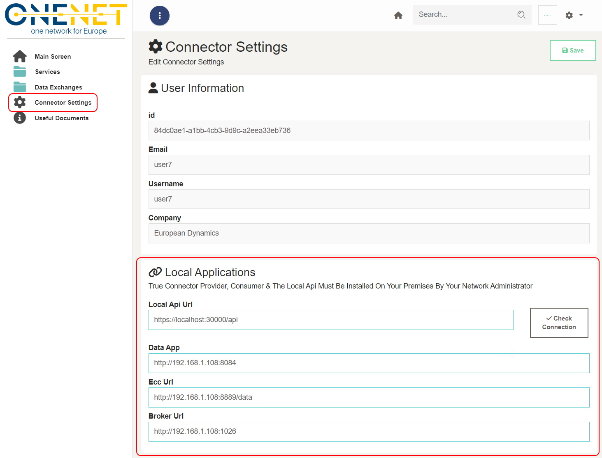

# **OneNet Deployment guide on Users Premisses**
## **Prerequisites and Installation**
The hardware and operating system prerequisites are:

- A 2-core processor 
- 4GB RAM Memory
- 50GB of disk space or more

The software prerequisites include:

- Centos 7 or Windows Server Operative System (OS);
- docker and docker-compose;

Onenet software and its components will be delivered utilizing the Docker containers functionalities. Firstly, the Docker platform has to be downloaded and installed accordingly to the OS of the server to host the deployment. 

### **For Windows server**

1. Install Docker from <https://hub.docker.com/?overlay=onboarding> (First you will need to create an account on the same page)
1. After the installation if Docker has not started automatically open start Menu, type Docker and select the Docker icon that appears.


*Figure 1. Launching Docker (Windows Server)*

3. Docker may take some time to start. When it has successfully started you should able to see the icon on the bottom right of your screen


*Figure 2. Docker Successfully Started (Windows Server)*

**Troubleshooting:**

- Docker in order to run requires specific support from the CPU but most recent PCs should support it. 
- Hyper-V should be installed and enabled in windows and Virtualization should be enabled in your BIOS.  Please also consult the following page <https://docs.docker.com/docker-for-windows/troubleshoot/#virtualization/> .

### **For Linux server**

1. Update the apt package index and install packages to allow apt to use a repository over HTTPS. 

For 64-bit version of CentOS type:
```
$ sudo yum update

$ sudo yum install \
 apt-transport-https \
 ca-certificates \
 curl \
 gnupg-agent \
 software-properties-common
```

For 64-bit version of one of Ubuntu versions (Groovy 20.10, Focal 20.04 (LTS), Bionic 18.04 (LTS), Xenial 16.04 (LTS)) type:
```
$ sudo apt-get update

$ sudo apt-get install \
apt-transport-https \
ca-certificates \
curl \
gnupg-agent \
software-properties-common
```
2. Add Docker’s official GPG key

`$ curl -fsSL https://download.docker.com/linux/ubuntu/gpg | sudo apt-key add -`

3. Verify the key by searching for the last 8 characters of the fingerprint.

`sudo apt-key fingerprint <last 8 characters of the fingerprint >`

4. Install Docker. According to the Docker installation[^1] we should:
- Set up the Docker repository.

For 64-bit version of CentOS type:
```
$sudo yum install -y yum-utils
$sudo yum-config-manager \
  --add-repo \
  https://download.docker.com/linux/centos/docker-ce.repo
```
For 64-bit version of Ubuntu use the following command to set up the stable repository:
```
$ sudo add-apt-repository \
   "deb [arch=amd64] https://download.docker.com/linux/ubuntu \
$(lsb_release -cs) \
   stable"
```
- Install the latest version of Docker Engine and *containerd*.

For 64-bit version of CentOS type:

`$sudo yum install docker-ce docker-ce-cli containerd.io`

For 64-bit versions of Ubuntu type:

`$ sudo apt-get install docker-ce docker-ce-cli containerd.io`

- Start and enable docker by typing:
```
$sudo systemctl start docker
$sudo systemctl enable docker
```
- Verify that Docker Engine is installed correctly by running the hello-world image:
  
`$ sudo docker run hello-world`

This command downloads a test image and runs it in a container. When the container runs, it prints an informational message and exits


5. Install Docker compose. Docker Compose is a tool for defining and running multi-container Docker applications. With Compose, we use a YAML Ain't Markup Language (YAML) file to configure our application’s services. Then, with a single command, we create and start all the services from our configuration. According to the docker compose installation  we should:
- Download the current stable release of Docker Compose, by typing:
  
`$ curl -L "https://github.com/docker/compose/releases/download/1.28.2/docker-compose-$(uname -s)-$(uname -m)" -o /usr/local/bin/docker-compose`

- Apply executable permissions to the binary, by typing:

`$sudo chmod +x /usr/local/bin/docker-compose`

## **Onenet Containers Installation on Docker**

To proceed with the installation of ONENET, the user must use the *docker* folder that contains all the necessary configuration.

6. Next step is to deploy Onenet using Docker Compose. First step is to clone the <https://github.com/european-dynamics-rnd/OneNet>  repository, by typing:
```
cd /opt/onenet-true-connector/
git clone https://github.com/european-dynamics-rnd/OneNet.git
```
7. There is the docker-compose.yml file located under */opt/onenet/onenet-true-connector/docker that contains all the configuration of the onenet fiware true connector containers. You can start the containers us the below commands   
```
$docker-compose up –d
$docker-compose logs -f
```
8. If no errors are seen, this means that ONENET FIWARE TRUE CONNECTOR was successfully deployed on your premisses.

## **Connection Settings Configuration through the User Interface**

For this step you must open the Onenet User Interface. 
The user interface is in a container that was installed on your premisses on the previous step.
It can be accessed through the url http://the_ip_where_the_containers_are_installed:30003 

### ** Instructions**

1. Login to the Ui Application using the username & password that you received from the onenet administrator.


2. Navigate to the connector settings by the sidebar menu & define the urls of your <code>Local Api Url</code>, <code>Data App Url</code>, <code>Ecc Url</code> & <code>Broker Url</code>  .




